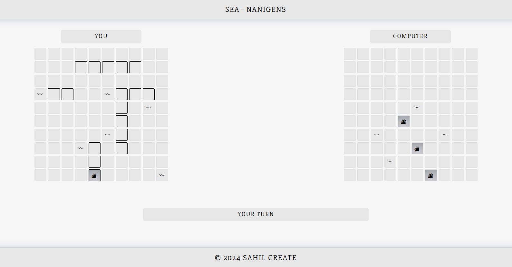

# Sea-Nanigens

## Result

[Click to try game live]()

## About the project

The main purpose was to practice Test Driven Development (TDD). We were asked to implement the classic game 'Battleship' while using TDD.

## Assignment

- [x] Your ‘ships’ will be objects that include their length, the number of times they’ve been hit and whether or not they’ve been sunk.
- [x] **REMEMBER** you only have to test your object’s public interface. Only methods or properties that are used outside of your ‘ship’ object need unit tests.
- [x] Ships should have a `hit()` function that increases the number of ‘hits’ in your ship
- [x] `isSunk()` should be a function that calculates whether a ship is considered sunk based on its length and the number of hits it has received.
- [x] Gameboards should be able to place ships at specific coordinates by calling the ship factory or class.
- [x] Gameboards should have a `receiveAttack` function that takes a pair of coordinates, determines whether or not the attack hit a ship and then sends the ‘hit’ function to the correct ship, or records the coordinates of the missed shot.
- [x] Gameboards should be able to report whether or not all of their ships have been sunk.
- [x] There will be two types of players in the game, ‘real’ players and ‘computer’ players. Each player object should contain its own gameboard.
- [x] Players should take turns playing the game by attacking the enemy Gameboard.
- [x] make the ‘computer’ players capable of making random plays. The computer does not have to be smart, but it should know whether or not a given move is legal.
- [x] Create conditions so that the game ends once one player’s ships have all been sunk

## Maybe in future

- [x] Implement drag and drop to allow players to place their ships.
- [ ] Create a 2-player option that lets users take turns by passing the laptop back and forth, or by spinning the monitor around on a desktop. Implement a ‘pass device’ screen so that players don’t see each other’s boards!
- [ ] Polish the intelligence of the computer player by having it try adjacent slots after getting a ‘hit’.
- [ ] Better visual and graphics
- [ ] Add sound effects
- [ ] Let user add their names
- [ ] Reset board option to again start game after it ends
